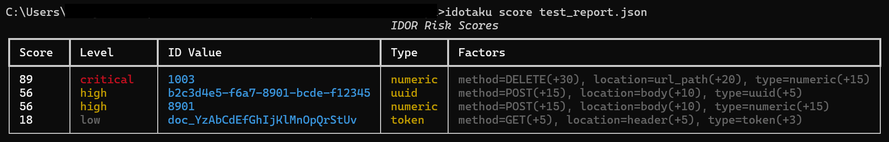
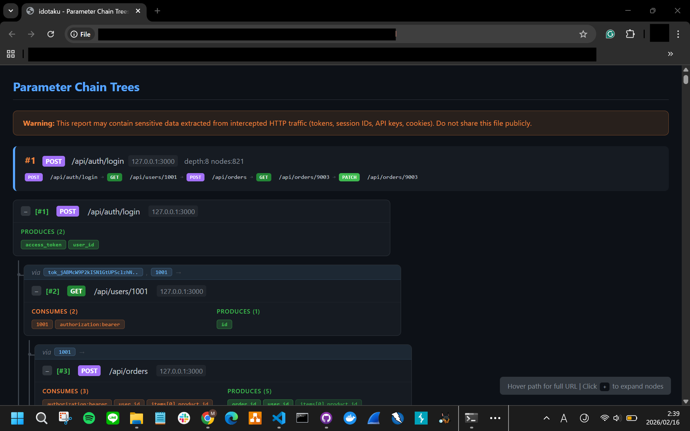

# IDOR-otaku (idotaku)

[](https://github.com/RalianENG/IDOR-otaku/actions/workflows/ci.yml)
[](https://github.com/RalianENG/IDOR-otaku)
[](https://pypi.org/project/idotaku/)
[](https://pypi.org/project/idotaku/)
[](https://opensource.org/licenses/MIT)
[](https://github.com/astral-sh/ruff)

**IDOR-otaku** — A reconnaissance tool that tracks how IDs flow through your API traffic to uncover IDOR attack surfaces. No Burp Suite required.

Unlike verification tools (Autorize, AuthMatrix) that test _whether_ access controls work, idotaku maps _where_ IDs originate, how they propagate across requests, and which ones appear without a traceable origin — revealing the attack surface before you start testing.

### Why idotaku?

- **ID lifecycle visibility** — Tracks where IDs are born (responses) and where they travel (requests). Visualizes parameter chains and API sequence diagrams as interactive HTML.
- **No Burp Suite required** — `pip install idotaku` and go. Works as a standalone CLI tool with mitmproxy.
- **HAR import** — Analyze traffic captured from Chrome DevTools, Burp Suite, or any other tool. No proxy setup needed for offline analysis.
- **CI/CD ready** — SARIF export integrates directly with GitHub Code Scanning. CSV export for custom pipelines.
- **Complements existing tools** — Use idotaku for reconnaissance, then feed candidates into Autorize/Burp for verification.

> **IDOR (Insecure Direct Object Reference)** is a vulnerability where an application exposes internal object IDs (user IDs, order numbers, etc.) without proper authorization checks, allowing attackers to access other users' data by manipulating these IDs.

## How It Works

```
┌─────────────┐     ┌─────────────┐     ┌─────────────┐
│   Browser   │────>│  mitmproxy  │────>│  API Server  │
└─────────────┘     └──────┬──────┘     └─────────────┘
                           │
                           v
                    ┌─────────────┐
                    │  idotaku    │
                    │  (tracker)  │
                    └──────┬──────┘
                           │
                           v
                    ┌─────────────┐
                    │   Report    │
                    │   (JSON)    │
                    └─────────────┘
```

1. **Intercept** — Proxies browser traffic via mitmproxy
2. **Track** — Records where IDs first appear (response) and where they are used (request)
3. **Detect** — Flags IDs used in requests that never appeared in any response (IDOR candidates)
4. **Visualize** — Renders parameter chains and API sequence diagrams as interactive HTML

## Requirements

- Python 3.10+
- mitmproxy 10.0+

## Installation

```bash
pip install idotaku
```

## Quick Start

```bash
# Interactive mode (recommended for beginners)
idotaku -i

# Start proxy directly
idotaku

# Analyze report
idotaku report id_tracker_report.json
idotaku chain id_tracker_report.json --html chain.html
idotaku sequence id_tracker_report.json --html sequence.html

# Import HAR file (from Chrome DevTools, Burp Suite, etc.)
idotaku import-har capture.har -o report.json
```

## Demo

Try idotaku with a built-in vulnerable API that demonstrates all detection capabilities:

```bash
cd examples/vulnerable_api

# One-command demo (Linux/macOS)
bash run_demo.sh

# Cross-platform (Windows/macOS/Linux)
python run_demo.py
```

The demo starts a vulnerable FastAPI server, proxies traffic through idotaku,
runs an automated attack scenario, and generates analysis reports.

### What You'll See

**Risk Scoring** — Four severity levels from a single test scenario:

```
Score  Level     ID Value              Type     Factors
─────  ────────  ────────────────────  ───────  ──────────────────────────
89     CRITICAL  1003                  numeric  DELETE, url_path, numeric
65     HIGH      1002                  numeric  PUT, url_path, numeric
46     MEDIUM    b2c3d4e5-f6a7-...     uuid     POST, body, uuid
18     LOW       doc_YzAbCdEfGh...     token    GET, header, token
```

**Parameter Chains** and **Sequence Diagrams** are exported as interactive HTML:

```bash
# Generated by the demo script:
# examples/vulnerable_api/chain.html     — card-based parameter chain tree
# examples/vulnerable_api/sequence.html  — UML-style API sequence diagram
```

<!-- TODO: Add screenshots after running the demo


-->

See [examples/vulnerable_api/](examples/vulnerable_api/) for details, or the
[Quick Start Guide](https://github.com/RalianENG/IDOR-otaku/blob/main/docs/QUICKSTART.md#try-the-demo)
for a step-by-step walkthrough.

## Commands

### Analysis

| Command | Description |
|---------|-------------|
| `report` | View IDOR detection report summary |
| `chain` | Detect parameter chains with `--html` export and `--domains` filter |
| `sequence` | API sequence diagram with `--html` export and ID highlighting |
| `lifeline` | Show parameter lifespan analysis |
| `score` | Risk-score IDOR candidates (critical / high / medium / low) |
| `auth` | Detect cross-user access patterns via auth context |
| `diff` | Compare two reports and show changes |
| `interactive` | Launch interactive mode with guided menus |

### Configuration

| Command | Description |
|---------|-------------|
| `config init` | Create default `idotaku.yaml` in the current directory |
| `config show` | Show effective configuration (defaults + config file) |
| `config get <key>` | Get a single config value (supports dotted keys: `patterns.uuid`) |
| `config set <key> <value>` | Set a config value in the YAML file |
| `config validate` | Validate config file syntax, types, and regex patterns |
| `config path` | Print the path to the active config file |

Interactive mode (`-i`) also provides a guided **setup wizard** for editing settings.

### Import & Export

| Command | Description |
|---------|-------------|
| `import-har` | Import HAR file and generate idotaku report |
| `csv` | Export IDOR candidates or flows to CSV |
| `sarif` | Export findings to SARIF 2.1.0 (GitHub Code Scanning) |

## Programmatic API

```python
from idotaku.report import load_report, score_all_findings, diff_reports
from idotaku.export import export_csv, export_sarif
from idotaku.import_har import import_har

# Load and score
data = load_report("report.json")
scored = score_all_findings(data.potential_idor)

# Export
export_csv("idor.csv", data, mode="idor")
export_sarif("findings.sarif.json", data)

# Import HAR
report = import_har("capture.har")

# Diff two reports
from idotaku.report import diff_reports
diff = diff_reports(load_report("old.json"), load_report("new.json"))
```

## Use Cases

### Bug Bounty Reconnaissance
Capture traffic while browsing a target, then analyze the report to find IDs that appear in requests without a traceable origin. These are your first IDOR candidates to investigate.

### Penetration Test Preparation
Before diving into manual testing, run idotaku to map the full ID landscape. The parameter chain analysis shows which API sequences share IDs — helping you prioritize where to test access controls.

### CI/CD Security Gate
Import HAR files from automated browser tests, generate a report, and export to SARIF. Integrate with GitHub Code Scanning to flag new IDOR candidates on every pull request.

### Post-Capture Offline Analysis
Already have traffic from Burp, Chrome DevTools, or another proxy? Import the HAR file and analyze it without setting up mitmproxy.

## Documentation

- [Quick Start Guide](https://github.com/RalianENG/IDOR-otaku/blob/main/docs/QUICKSTART.md)
- [Specification](https://github.com/RalianENG/IDOR-otaku/blob/main/docs/SPECIFICATION.md)
- [Comparison with Other Tools](https://github.com/RalianENG/IDOR-otaku/blob/main/docs/COMPARISON.md)
- [日本語 / Japanese README](https://github.com/RalianENG/IDOR-otaku/blob/main/docs/README_ja.md)

## Contributing

```bash
# Clone and install with dev dependencies
git clone https://github.com/RalianENG/IDOR-otaku.git
cd idotaku
pip install -e ".[dev]"

# Run tests
pytest

# Run tests with coverage
pytest --cov=idotaku

# Lint
ruff check src/
```

Bug reports and pull requests are welcome on [GitHub Issues](https://github.com/RalianENG/IDOR-otaku/issues).

## Disclaimer

This tool is intended for **authorized security testing and educational purposes only**. You must obtain proper authorization before testing any systems you do not own. The authors are not responsible for any misuse or damage caused by this tool. Use at your own risk and in compliance with all applicable laws.

## License

[MIT](LICENSE)